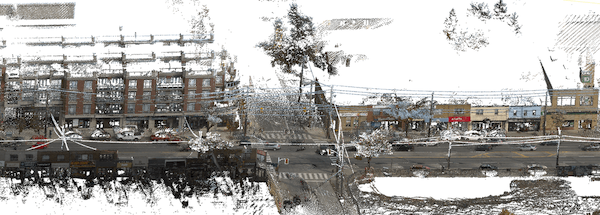
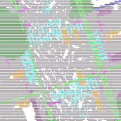
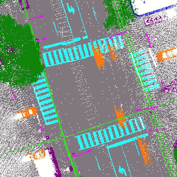

# Toronto-3D: A Large-scale Mobile LiDAR Dataset for Semantic Segmentation of Urban Roadways

Toronto-3D is a large-scale urban outdoor point cloud dataset acquired by an MLS system in Toronto, Canada for semantic segmentation. This dataset covers approximately 1 km of road and consists of about 78.3 million points. Point clouds has [10 attributes](#attributes) and classified in [8 labelled object classes](#classes). There is a data preparation [tip](#tip) to handle UTM coordinates to avoid problems. There are also some [known issues](#issues).

Details on the dataset can be found at [CVPRW2020](http://openaccess.thecvf.com/content_CVPRW_2020/html/w11/Tan_Toronto-3D_A_Large-Scale_Mobile_LiDAR_Dataset_for_Semantic_Segmentation_of_CVPRW_2020_paper.html). Revisions on the labels will lead to different results from the published paper, and updated results will be updated [here](#results).

Dataset can be downloaded at [OneDrive](https://1drv.ms/u/s!Amlc6yZnF87psX6hKS8VOQllVvj4?e=yWhrYX) or [百度网盘](https://pan.baidu.com/s/16FVZqPU-I56rFRrGWoaxXA)(提取码：aewp).
Check [Changelog](#changelog) for changes.

Toronto-3D belongs to [Mobile Sensing and Geodata Science Lab](https://uwaterloo.ca/mobile-sensing/), University of Waterloo. 

Teledyne Optech is acknowledged for providing mobile LiDAR point cloud data collected by [Maverick](https://www.teledyneoptech.com/en/products/mobile-survey/maverick/). Thanks Jing Du and Dr. Guorong Cai from Jimei University for point cloud labelling.

If you have questions, or any suggestions to help us improve the dataset, please contact [Weikai Tan](mailto:weikai.tan@uwaterloo.ca).

---
##  Semantic segmentation results with point coordinates

More results to be added

| Method          | OA     | mIoU   | Road   | Road marking | Natural | Building | Utility line | Pole   | Car    | Fence  |
|------------------|--------|--------|--------|----------|---------|----------|-----------|--------|--------|--------|
| [PointNet++](https://github.com/charlesq34/pointnet2/blob/42926632a3c33461aebfbee2d829098b30a23aaa/models/pointnet2_sem_seg.py#L18)       | 84.88% | 41.81% | 89.27% | 0.00%    | 69.06%  | 54.16%   | 43.78%    | 23.30% | 52.00% | 2.95%  |
| PointNet++ *     | 91.66% | 58.01% | 92.71% | 7.68%    | 84.30%  | 81.83%   | 67.44%    | 63.30% | 60.92% | 5.92%  |
| [PointNet++ MSG](https://github.com/charlesq34/pointnet2/blob/42926632a3c33461aebfbee2d829098b30a23aaa/models/pointnet2_cls_msg.py#L17) | 92.56% | 59.47% | 92.90% | 0.00%    | 86.13%  | 82.15%   | 60.96%    | 62.81% | 76.41% | 14.43% |
| [DGCNN](https://github.com/WangYueFt/dgcnn/blob/20fdb459ca5d10fe8aba1d296e66340f65990b85/tensorflow/sem_seg/model.py#L20)  | 94.24% | 61.79% | 93.88% | 0.00% | 91.25% | 80.39% | 62.40% | 62.32% | 88.26% | 15.81% |
| [KPFCNN](https://github.com/HuguesTHOMAS/KPConv/blob/132fdc628fb4850548e931c8b02c6325e7cac85e/training_NPM3D.py#L49)           | 95.39% | 69.11% | 94.62% | 0.06%    | 96.07%  | 91.51%   | 87.68%    | 81.56% | 85.66% | 15.72% |
| [MS-PCNN](https://doi.org/10.1109/TITS.2019.2961060) | 90.03% | 65.89% | 93.84% | 3.83% | 93.46% | 82.59% | 67.80% | 71.95% | 91.12% | 22.50% |
| [TGNet](https://doi.org/10.1109/TGRS.2019.2958517)            | 94.08% | 61.34% | 93.54% | 0.00%    | 90.83%  | 81.57%   | 65.26%    | 62.98% | 88.73% | 7.85%  |
| MS-TGNet         | 95.71% | 70.50% | 94.41% | 17.19%   | 95.72%  | 88.83%   | 76.01%    | 73.97% | 94.24% | 23.64% |

\* use same radii and k as TGNet

---
##  Point cloud attributes 
* XYZ
* RGB
* Intensity
* GPS time
* Scan angle rank

##  Classes 
* Road (label 1) 
* Road marking (label 2)
* Natural (label 3)
* Building (label 4)
* Utility line (label 5)
* Pole (label 6)
* Car (label 7)
* Fence (label 8)
* unclassified (label 0)

---
##  Data preparation tip
The XY coordinates are stored in UTM format. The Y coordinate may exceed decimal digits in `float` type commonly used in point cloud processing algorithms. Directly read and process the coordinates could result in loss of detail and wrong geometric features.

I set a `UTM_OFFSET = [627285, 4841948, 0]` to subtract from the raw coordinates. You may use any other numbers to reduce number of digits.

Example of potential issues during `grid_subsampling` operation used in KPConv and RandLA-Net: both subsampled to grid size 6cm

| without offset | with offset |
|:--------------:|:-----------:|
|  |  |

---
##  Known issues 

1. Point RGB assignments on taller vehicles.

2. Point RGB artifact assignments on moving vehicles.

3. Point acquisition on moving vehicles.

---
##  Changelog 

* [2020-04-23] Uploaded newest version. Fixed some labelling errors. Major revision on cars.

* [2020-03-22] Uploaded newest version.